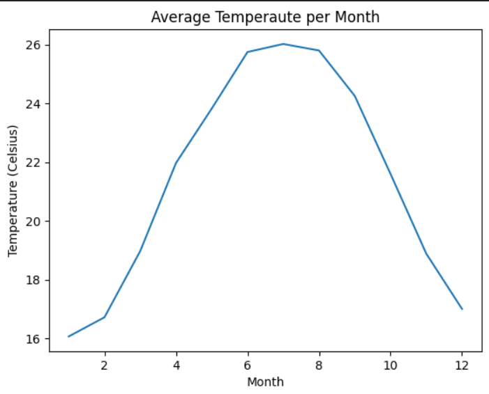
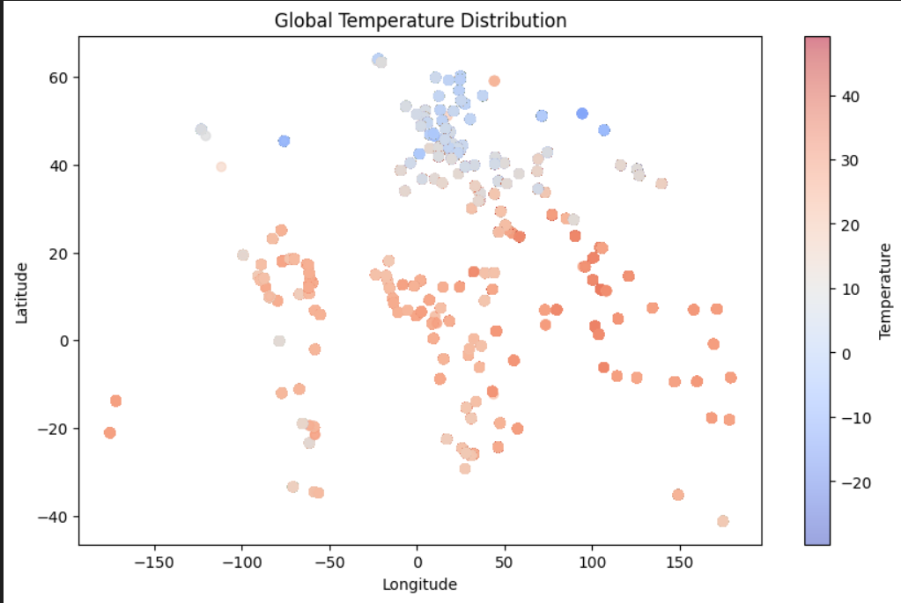
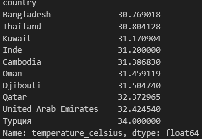
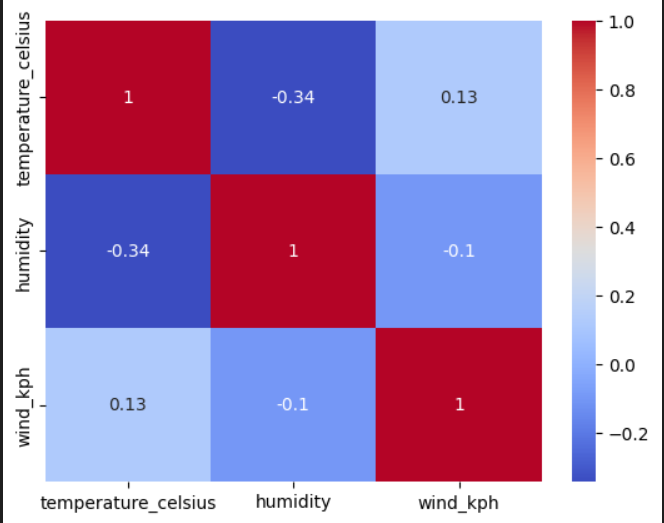
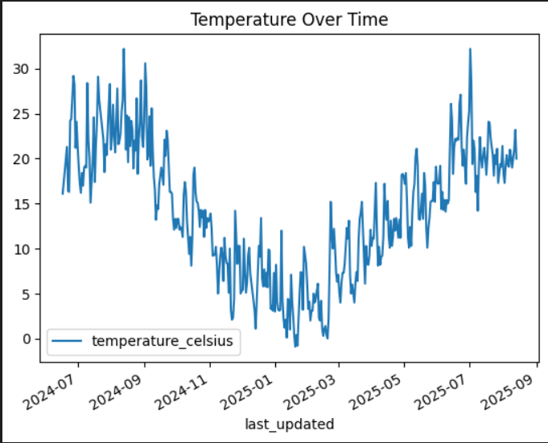
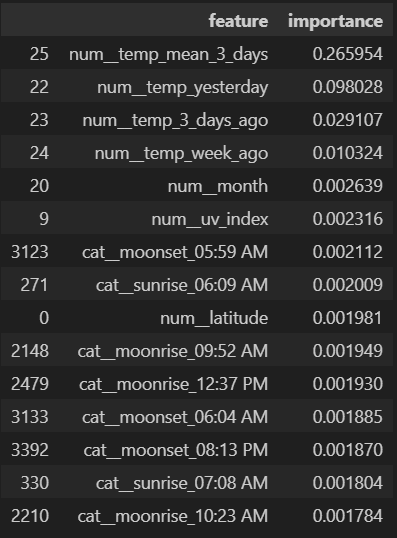
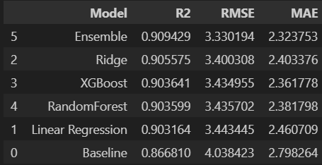

## PM Accelerator mission

By making industry-leading tools and education available to individuals from all backgrounds, we level the playing field for future PM leaders. This is the PM Accelerator motto, as we grant aspiring and experienced PMs what they need most – Access. We introduce you to industry leaders, surround you with the right PM ecosystem, and discover the new world of AI product management skills

# Weather Forecasting

The goal of this project is to develop machine learning models to forecast temperature using historical wather data and analyze climate patterns across different regions.

## Overview

This project focuses on building a time-aware machine learning system to forecast future temperature values using historical weather data collected across multiple global locations. The workflow begins with data cleaning and preprocessing, including datetime conversion, handling missing values, and ensuring proper chronological ordering to prevent data leakage. Extensive feature engineering was performed to capture temporal patterns, including lag features (e.g., previous day/week temperatures) and rolling statistics, alongside extracted time-based features such as month and day of week.

Exploratory data analysis (EDA) was conducted to understand seasonal trends, geographical temperature distribution, and relationships between environmental variables. Several machine learning models were then developed and tuned using time-series cross-validation, including Linear Regression, Ridge, Random Forest, and XGBoost. An ensemble model was also created to combine the strengths of different approaches. Model performance was evaluated using R², RMSE, and MAE metrics, showing strong predictive capability driven primarily by recent temperature history.

## Exploratory Data Analysis (EDA)

EDA was conducted to understand temporal petterns, geographical distributions, and relationships between wather variables.

### Seasonal Temperature Trends


- Clear seasonal pattern observed
- Temperatures increase steadily from winter to summer
- Peak temperatures occur around mid-year (June–August)
- Decline begins towards the end of the year

This confirms strong seasonality, which justifies the use of time-based and lag features in modeling.

### Global Temperature Distribution (Spatial Analysis)


- Warmer regions concentrated near the equator
- Cooler temperatures observed at higher latitudes
- Clear global climate gradient (tropical → temperate → polar)
- This demonstrates strong spatial dependence in temperature patterns.

### Country-Level Temperature Analysis


- Highest average temperatures observed in tropical countries
- Consistent regional climate differences
- Supports inclusion of location-based features (latitude/longitude)

### Corelation Analysis


- Temperature and humidity show moderate negative correlation (~ -0.34)
- Wind speed has weak correlation with temperature
- Indicates humidity is more informative for temperature prediction than wind

### Time Series Analysis


- Clear seasonal patterns
- Short-term fluctuations present (noise)
- Strong temporal dependency which supports use of lag features

## Data Cleaning

A structured data cleaning process was performed to ensure data quality, consistency, and suitability for time-series forecasting.

1. The "last_updated" column was converted to a proper datetime format:
    ```
    df["last_updated"] = pd.to_datetime(df["last_updated"])
    ```
    This allowed extraction of time-based features and enabled proper chronological sorting

2. To prevent data leakage and ensure correct temporal relationships, the dataset was sorted by location and time:
    ```
    df = df.sort_values(by=["location_name", "last_updated"])
    ```
    This step is critical for:

    - Generating lag features correctly
    - Maintaining chronological order for forecasting
    - Ensuring valid train/test splits

3. Handling Missing Values

   - There were no missing values in the initial data, but they were introduced by lag and rolling feature creation.
   - Since dtatset is large enough, it was decided to drop null values since id did not lead to a massive data loss.

4. Unrealistic data like tempertaure and pressure was handled with relistic values.
    ```
    df["pressure_mb"] = df["pressure_mb"].clip(
        lower=MIN_POSSIBLE_PRESSURE,
        upper=MIN_POSSIBLE_PRESSURE
    )
    ```
    ```
    df["wind_kph"] = df["wind_kph"].clip(upper=MAX_POSSIBLE_WIND)
    ```

5. Feature Selection and Removal

   Certain columns were removed before modeling:

   Removed Features:

    - "target_temp" - prediction target
    - "temperature_celsius" - current value (could lead to leakage)
    - "feels_like_celsius" - not necessary
    - "last_updated" - replaced by engineered time features


## Ferecasting Models 

## Feature Engineering

Feature engineering was important part of this project, as weather forecasting relies on temporal petterns and historical trends.

To incorporate past temperature infrormation laf features were created using previous obesrvation:

- temp_yesterday
- temp_3_days_ago
- temp_week_ago

- temp_mean_3_days (average temp in 3 days)
- temp_mean_week (average temp ina week)

Also, the forecasting target was defines as a fure tempearure values 

- target_temp

The setup allows the model to predict the future temperature/weather.

## Avoiding Data Leakage

To avoid data leakage and try to be close to realistic forecasting:

- Current temperature (temperature_celsius) was removed from features
- Derived variable such as feels_like_celsius adn not important features were dropped 
- All data was sorted chronologically within each location

These steps ensured that the model only used past information when making predictions. 

## Models used

- Baseline (yesterday)
- Linear Regression
- Ridge (tuned to alpha = 100.0)
- XGBoost (tuned to bytree = 0.8, learning_rate = 0.05, max_depth = 8, n_estimators = 100, subsample = 0.8)
- Random Forest Regression
- Simple ensembe

## Metrics used

- R^2
- RMSE
- MAE

## Feature Importances 
Feature importance was analyzed using a XGBoost model to understand which variables contribute most to temperature prediction.



1. The most important features are:

    - 3-day rolling average 
    - Yesterday’s temperature
    - Recent lag values (3 days, 1 week)

2. Seasonal and environmental features contribute minimally

     - "month", "uv_index", "latitude" all have very low importance

3. All categorical features contribute minimally

    - Features like sunrise/sunset times have very small importance

## Results 

Multiple models were trained and evaluated using time-aware validation, including Linear Regression, Ridge, Random Forest, XGBoost, and an Ensemble model



### Result Analysis

- All models significantly outperform the baseline
- This indicates that temperature is highly predictable using historical patterns
- Confirms earlier EDA findings: strong temporal dependency and seasonality

2. Minimal Gap Between Models

    - Ridge: 0.9056
    - XGBoost: 0.9036
    - Random ForestRgression: 0.9036

    This probably happends because:

    - The problem is mostly linear
    - Complex models (RF, XGB) do not add much value


3. Ensemble Model Performs Best

    - Ensemble achieves highest R² and lowest error

    - Combines:
    - Linear patterns (Ridge, RandomForestRegression)
    - Non-linear patterns (XGBoost)

    - However:
        - Improvement is small
        - Indicates most signal is already captured by simpler models

4. Baseline Comparison 

    - Baseline (yesterday’s temp): R² ≈ 0.867
    - Best model: R² ≈ 0.909

5. Is it a data leakage?

     The high performance (~0.909 R²) is expected and valid, NOT necessarily leakage, because:

    - Temperature evolves smoothly over time
    - Lag features (yesterday, weekly averages) are naturally predictive
    - Specific featurues were removed to avoid data leakage and tested.


## How To Run 

1. Installation

    Clone the repository:

    ```
    git clone https://github.com/your-username/weather_trend_forecasting_assessment.git
    cd weather_trend_forecasting_assessment

    ```
    Install required dependencies:

    ```
    pip install -r requirements.txt
    jupyter notebook 
    ```

    ** requirements.txt: **

    ```
    pandas
    numpy
    scikit-learn
    matplotlib
    seaborn
    xgboost
    ```

2. Project Structure

    ```
    weather_trend_forecasting_assessment/
    ├── images/
    │   ├── corelation_analysis.png
    │   ├── country-level.png
    │   ├── feature_importances
    │   ├── results.png
    │   ├── seasonal_temp.png
    │   ├── spatial_analysis.png
    │   └── time_series.png
    │   
    │
    ├── forecast.ipynb  
    ├── GlobalWeatherRepository.csv      # data
    └── README.md
    ```

3.  Run the Project

    Open the main notebook:

    jupyter notebook notebooks/forecast.ipynb

    Then execute all cells in order.

4. Pipeline Overview

    The notebook performs the following steps:

        1. Data Cleaning

        - Convert datetime
        - Sort data by location and time
        - Handle missing values

        2. Feature Engineering
        
        - Create lag features (yesterday, week ago)
        - Create rolling averages (3-day, weekly)
        - Extract time-based features (month, day of week)

        3. Train/Test Split
        
        - Split data chronologically per location
        - Prevents data leakage

        4. Model Training
        
        - Linear Regression
        - Ridge Regression (with tuning)
        - Random Forest
        - XGBoost

        5. Model Evaluation
        
        - Metrics: R², RMSE, MAE
        - Time-series cross-validation used

        6. Ensemble Model
        
        - Combines Ridge, XGBoost, RandomForestRegression predictions

        7. Feature Importance & Analysis

5. Make Predictions

    To generate predictions using the trained models:
    ```
    pred = best_model.predict(X_test)
    ```

    For ensemble:

    ```
    pred_ensemble =  0.5 * pred_ridge + 0.3 * pred_xgb + 0.2 * pred_rf
    ```

## Future imporvements
While the current model achieves strong performance, several enhancements could further improve forecasting accuracy and robustness. The current ensemble uses simple averaging between Ridge and XGBoost. Future work could explore stacking (meta-learning), where predictions from multiple models (Ridge, Random Forest, XGBoost) are used as inputs to a secondary model. This approach could better capture both linear and non-linear relationships and potentially improve overall performance. Although hyperparameter tuning was applied, further optimization could be explored:
Expanding search space for Random Forest , XGBoost ussing RandomizedSearchCV or Bayesian optimization for more efficient exploration. Due to computational constraints, the current tuning was limited to a smaller parameter grid. One of the main limitations of this project was training time, especially when using GridSearchCV with time-series cross-validation and complex models such as XGBoost. Future improvements could include: use of RandomizedSearchCV for faster tuning or reducing dataset size via sampling or aggregation.

## Author

**Anastasiia Chekanina**
Computer Science Student at University Of British Columbia